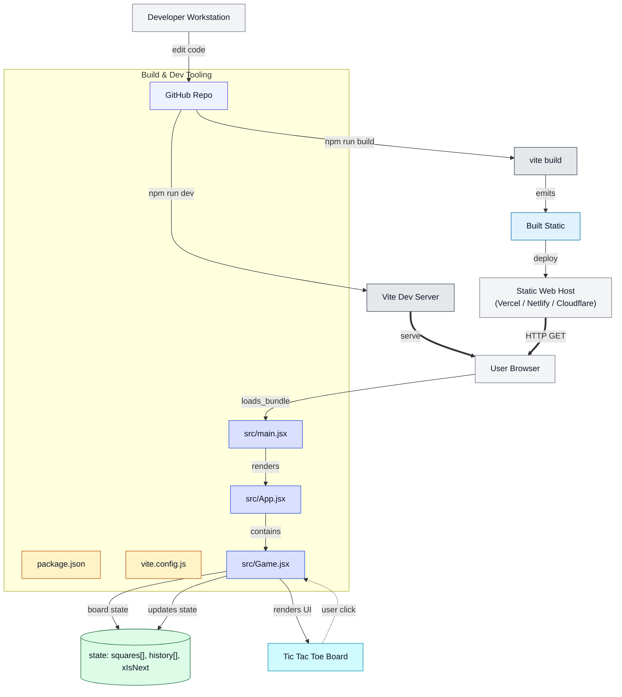

# 🎮 Tic Tac Toe Game (React)

A modern and interactive Tic Tac Toe game built with **React.js** and **Tailwind CSS**, featuring move history tracking and winner/draw detection.

---

## 🚀 Live Demo
> (https://fahadfive.vercel.app/)

---

## 🛠 Tech Stack
- React.js (Functional Components)
- JavaScript (ES6+)
- Tailwind CSS
- React Hooks (`useState`)
- Component-based Architecture

---

## ✨ Features
- Interactive Tic Tac Toe gameplay
- Player turn indicator (X / O)
- Automatic winner detection
- Draw match detection
- Match history with time-travel functionality
- Jump to any previous move
- Reset and replay game option
- Clean, modern, and responsive UI
- Smooth hover and click animations

---

## 📁 Component Structure
```
└── 📁tic-tac-toe
    └── 📁public
        ├── vite.svg
    └── 📁src
        └── 📁assets
            ├── react.svg
        ├── App.css
        ├── App.jsx
        ├── Game.jsx
        ├── index.css
        ├── main.jsx
    ├── .gitignore
    ├── eslint.config.js
    ├── index.html
    ├── package-lock.json
    ├── package.json
    ├── README.md
    └── vite.config.js
```
## 🏗 Architecture Diagram

<details>
<summary>Click to expand architecture diagram</summary>



</details>
